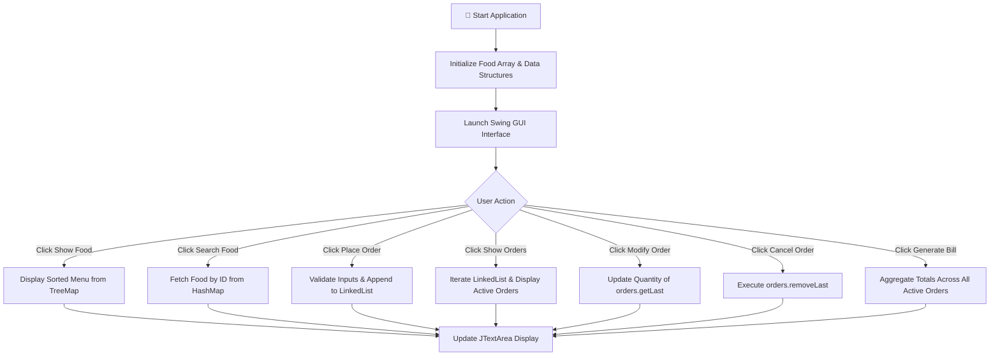

# 🍔 Food Delivery Management System

[](https://www.oracle.com/java/)
[](https://docs.oracle.com/javase/tutorial/uiswing/)
[]()
[](LICENSE)

> **A feature-rich Java Swing desktop application** designed for streamlined food ordering, real-time menu lookup, order modification, cancellation, and automated billing calculation using Java Collections Framework and OOP principles.

---

## 📋 Table of Contents

- [ Overview](#-overview)
- [🎯 Problem Statement](#-problem-statement)
- [✨ Key Features](#-key-features)
- [🛠️ Tech Stack & Concepts](#️-tech-stack--concepts)
- [🏗️ System Architecture](#️-system-architecture)
- [📂 Project Structure](#-project-structure)
- [🍽️ Predefined Menu](#️-predefined-menu)
- [🧠 Data Structures Utilized](#-data-structures-utilized)
- [🔄 Workflow & Program Flow](#-workflow--program-flow)
- [⚙️ Core Operations](#️-core-operations)
- [🖥️ User Interface Overview](#️-user-interface-overview)
- [🚀 Quick Start & Installation](#-quick-start--installation)
- [🧪 Sample Execution](#-sample-execution)
- [📈 Advantages & Limitations](#-advantages--limitations)
- [🗺️ Future Roadmap](#️-future-roadmap)
- [👥 Authors & Team](#-authors--team)
- [📜 License & Acknowledgments](#-license--acknowledgments)

---

## 📌 Overview

The **Food Delivery Management System** is an interactive desktop GUI application built as a Java Mini Project. It encapsulates fundamental and advanced software engineering concepts including **Object-Oriented Programming (OOP)**, **Java Collections Framework (JCF)**, **Java Swing / AWT UI components**, event-driven programming, and robust exception handling.

The system empowers users to seamlessly view predefined food menus, search for items by unique IDs, place orders for multiple customers, view active orders, modify quantities dynamically, cancel orders, and generate itemized billing totals.

---

## 🎯 Problem Statement

Traditional manual order processing in small eateries or food counters often leads to operational bottlenecks such as:
- **Prone to Human Error:** Manual bill calculation and item lookup errors.
- **Order Tracking Friction:** Difficulty in tracking active, pending, or modified customer orders simultaneously.
- **Lack of Quick Search:** Slow retrieval of item pricing and details during peak hours.
- **Unfriendly Interface:** Lack of a modern GUI forcing staff to rely on manual paper logs.

This application resolves these issues by delivering a lightweight, zero-dependency desktop solution that automates food lookup, order queueing, and total cost computation.

---

## ✨ Key Features

| Feature | Description |
| :--- | :--- |
| 🍕 **Interactive Food Menu** | Displays all predefined food items along with prices in a clear, sorted list. |
| 🔎 **Instant Food Search** | $O(1)$ constant-time lookup for food items by **Food ID** using `HashMap`. |
| 🛒 **Order Placement** | Seamlessly captures Customer Name, Food ID, and Quantity into an active order queue. |
| 📋 **Active Orders Monitor** | Displays real-time details of all currently queued customer orders. |
| ✏️ **Dynamic Order Modification** | Instantly updates the quantity of the latest placed order. |
| ❌ **Order Cancellation** | Removes the latest order from the active queue using $O(1)$ `LinkedList` operation. |
| 🧾 **Automated Billing** | Computes the aggregated total cost of all active customer orders accurately. |
| ⚠️ **Input Validation** | Guarantees system stability via `try-catch` blocks against malformed numeric or null inputs. |
| 🖥️ **Event-Driven GUI** | Modern layout built with `Java Swing`, `AWT`, and clean Lambda event listeners. |

---

## 🛠️ Tech Stack & Concepts

* **Language:** Java (JDK 8+)
* **GUI Framework:** Java Swing (`JFrame`, `JPanel`, `JButton`, `JTextArea`, `JTextField`, `JLabel`)
* **Layout Managers:** `BorderLayout`, `GridLayout`, `FlowLayout`
* **Data Structures & Collections:**
  * `Array` – Predefined menu initialization
  * `HashMap<Integer, Food>` – $O(1)$ rapid key-value lookup by Food ID
  * `TreeMap<Integer, Food>` – Sorted menu ordering by Food ID
  * `LinkedList<Order>` – Dynamic FIFO/LIFO queue for customer order management
* **Programming Paradigms:** Object-Oriented Programming (Encapsulation, Data Abstraction), Event-Driven Architecture, Lambda Expressions

---

## 🏗️ System Architecture

```mermaid
graph TD
    User([👤 User / Cashier]) <--> GUI[🖥️ Java Swing GUI Layer]
    
    subgraph Core Engine
        GUI --> Controller[FoodDeliverySystem Main Controller]
        Controller <--> FoodObj[📦 Food Model]
        Controller <--> OrderObj[🧾 Order Model]
    end
    
    subgraph Data Layer & Collections
        Controller -->|Search Lookup O(1)| HashMap[🔑 HashMap: Food ID -> Food]
        Controller -->|Sorted Display| TreeMap[🗂️ TreeMap: Sorted Food Menu]
        Controller -->|Queue & Stack Ops| LinkedList[📋 LinkedList: Active Orders]
    end
```

---

## 📂 Project Structure

```text
FoodDeliverySystem/
├── 📄 FoodDeliverySystem.java   # Core source code (Models, Controllers & Swing GUI)
├── 📄 README.md                 # Project documentation & execution guide
└── 📄 LICENSE                   # Project license file
```

### Class Design Summary

* **`Food`**: Encapsulates item details (`int id`, `String name`, `double price`).
* **`Order`**: Represents a customer order record (`String customer`, `Food food`, `int quantity`), providing a utility method `total()` to calculate `food.price * quantity`.
* **`FoodDeliverySystem`**: Main entry class hosting the Swing GUI component setup, data structure initialization, and event listener handlers.

---

## 🍽️ Predefined Menu

| Food ID | Food Name | Price (₹) |
| :---: | :--- | :---: |
| `101` | Pizza | ₹250 |
| `102` | Burger | ₹150 |
| `103` | Biryani | ₹220 |
| `104` | Dosa | ₹100 |
| `105` | Pasta | ₹180 |

---

## 🧠 Data Structures Utilized

```java
// 1. Array: Predefined food catalog initialization
static Food[] foods = {
    new Food(101, "Pizza", 250),
    new Food(102, "Burger", 150),
    new Food(103, "Biryani", 220),
    new Food(104, "Dosa", 100),
    new Food(105, "Pasta", 180)
};

// 2. HashMap: O(1) Fast Food Lookup by Food ID
static HashMap<Integer, Food> foodMap = new HashMap<>();

// 3. TreeMap: Key-sorted food listing
static TreeMap<Integer, Food> sortedFood = new TreeMap<>();

// 4. LinkedList: Sequential customer order management & quick access to latest order
static LinkedList<Order> orders = new LinkedList<>();
```

> [!NOTE]
> `LinkedList` is selected for orders because it enables $O(1)$ constant-time insertion at the end (`orders.add()`), quick retrieval of the latest order (`orders.getLast()`), and efficient cancellation (`orders.removeLast()`).

---

## 🔄 Workflow & Program Flow



---

## ⚙️ Core Operations

### 1. 🔎 Search Food (`searchFood()`)
Parses the input Food ID from the text field and performs a direct lookup in `foodMap`.
```java
int id = Integer.parseInt(idField.getText());
Food food = foodMap.get(id);
if (food != null) {
    output.setText("FOOD FOUND\n\nID: " + food.id + "\nName: " + food.name + "\nPrice: ₹" + food.price);
} else {
    output.setText("⚠️ Food item not found!");
}
```

### 2. 🛒 Place Order (`placeOrder()`)
Validates user input, fetches the food item, creates a new `Order` instance, and adds it to the `orders` list.
```java
Order order = new Order(customerName, food, quantity);
orders.add(order);
output.setText("✅ ORDER PLACED!\nCustomer: " + customerName + "\nTotal: ₹" + order.total());
```

### 3. ✏️ Modify Order (`modifyOrder()`)
Retrieves the last order added to the queue via `orders.getLast()` and updates its quantity dynamically.

### 4. ❌ Cancel Order (`cancelOrder()`)
Removes the most recently placed order using `orders.removeLast()`.

### 5. 🧾 Generate Bill (`generateBill()`)
Traverses all orders stored in `orders` and computes the grand total.
$$\text{Grand Total} = \sum_{i=1}^{n} (\text{Price}_i \times \text{Quantity}_i)$$

---

## 🖥️ User Interface Overview

The interface features a multi-panel Swing layout:
* **Header Panel:** North layout displaying application title with clean typography.
* **Input Form Panel:** West layout featuring labeled text fields for *Customer Name*, *Food ID*, and *Quantity*.
* **Control Buttons:** Embedded action buttons triggering core methods via Lambda event listeners.
* **Output Console:** Center layout featuring a scrollable, non-editable `JTextArea` displaying real-time updates and formatted tables.

---

## 🚀 Quick Start & Installation

### Prerequisites

* **Java Development Kit (JDK 8 or higher)** installed.
* Command terminal or any Java IDE (IntelliJ IDEA, Eclipse, VS Code).

### Step-by-Step Setup

1. **Clone the Repository:**
   ```bash
   git clone https://github.com/bhavikakhabya/Java_MiniProject.git
   cd Java_MiniProject
   ```

2. **Compile the Java Application:**
   ```bash
   javac FoodDeliverySystem.java
   ```

3. **Run the Application:**
   ```bash
   java FoodDeliverySystem
   ```

---

## 🧪 Sample Execution

### Scenario: Placing an Order & Generating a Bill

1. **Search Item:**
   * Enter `Food ID: 101` $\rightarrow$ Click **Search Food**
   * *Output:* `FOOD FOUND: Pizza - ₹250`

2. **Place Customer Order:**
   * Customer: `Ayush` | Food ID: `101` | Quantity: `2` $\rightarrow$ Click **Place Order**
   * *Output:* `ORDER PLACED! Total: ₹500`

3. **Generate Final Bill:**
   * Click **Generate Bill**
   * *Output:*
     ```text
     ==================================
              FINAL BILL RECEIPT
     ==================================
     1. Customer: Ayush | Item: Pizza | Qty: 2 | Amt: ₹500
     ----------------------------------
     GRAND TOTAL: ₹500
     ==================================
     ```

---

## 📈 Advantages & Limitations

###  Advantages
- **Zero External Dependencies:** Built purely on standard Java Core & Swing libraries.
- **Fast Execution:** Optimized lookup speeds using `HashMap` ($O(1)$ time complexity).
- **Crash Proof:** Protected against invalid user input (e.g., entering text into numeric fields).
- **User Friendly:** Clear desktop GUI interface eliminating the need for terminal commands.

### ⚠️ Current Limitations
- **In-Memory Storage:** Data is stored in memory and resets when the application is closed.
- **Single File Architecture:** Logic, GUI, and data structures reside in `FoodDeliverySystem.java`.
- **Latest Order Scoped Operations:** Order modifications and cancellations currently apply to the latest order (`getLast()`).

---

## 🗺️ Future Roadmap

- [ ] 🗄️ **Database Integration:** Connect with MySQL / PostgreSQL via JDBC for persistent order and menu records.
- [ ] 🔐 **Role-Based Access Control:** Implement Admin (Menu & Order Management) and Cashier login views.
- [ ] 🆔 **Unique Order ID System:** Track and modify specific orders by unique UUID / Order IDs.
- [ ] 📄 **PDF Invoice Export:** Generate downloadable PDF receipts with tax split (CGST/SGST).
- [ ] 🎨 **FlatLaf Modern UI:** Upgrade Swing aesthetics using modern Look-and-Feel themes.

---

## 👥 Authors & Team

This project was developed as part of a **Java Mini Project** by:

| Name | Role / Contribution |
| :--- | :--- |
| 👩‍💻 **Bhavika Khabya** | Core Java Logic & Data Structures |
| 👩‍💻 **Ishita Nakhawa** | Swing GUI Design & Event Handling |
| 👨‍💻 **Ayush Mishra** | Order Logic & Documentation |
| 👨‍💻 **Gouresh Parab** | Testing & Input Validation |

---

## 📜 License & Acknowledgments

This project is open-source and available under the **[MIT License](LICENSE)**. 

---

<p align="center">
  <b>🍔 Food Delivery Management System</b><br>
  Developed with ❤️ using Java, Swing & Java Collections Framework
</p>
